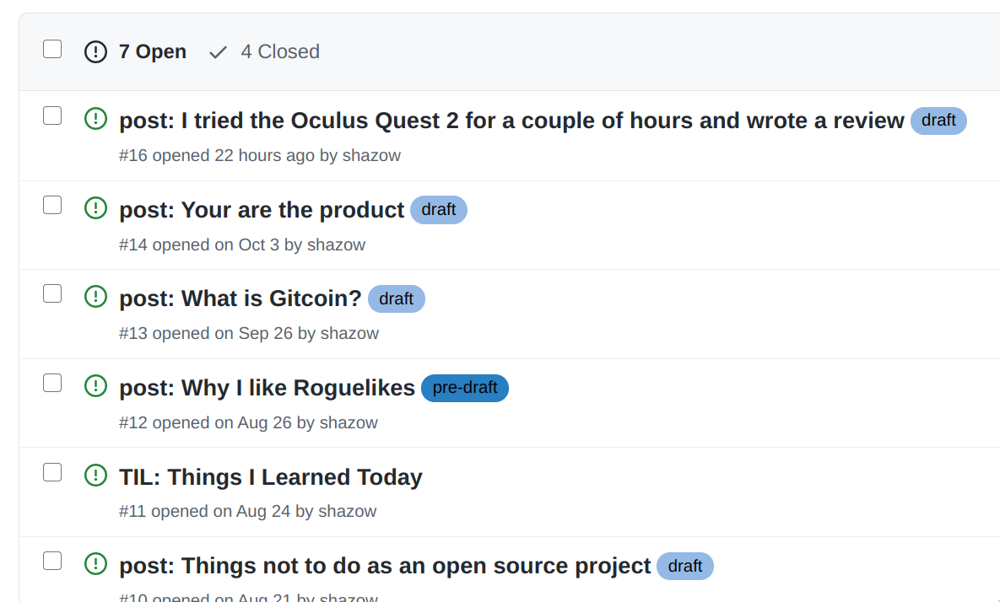
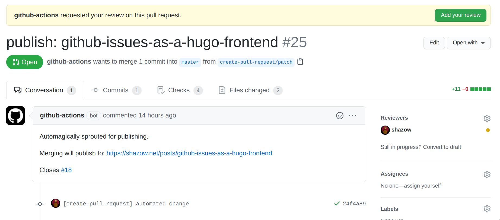

+++
title = "Using Github Issues as a Hugo frontend with Github Actions and Netlify"
date = "2020-12-01"
image = "100763300-fa3e7000-33c2-11eb-9172-206f58556ddd.png"
+++

I got into the habit of dumping quick blog post ideas into issues on my blog's repo. It's a convenient place to iterate on them and share with friends for feedback before actually publishing on my blog post.



The drafts keep accumulating, how do I trick myself into publishing more? Perhaps by reducing the effort required for the next step? Let's do it!

## Architecture

My blog is statically generated using [Hugo](https://github.com/gohugoio/hugo), the [code is hosted on Github](https://github.com/shazow/shazow.net), then when a pull request comes in it is built, previewed, and published on merge by [Netlify](https://netlify.com/).

The blog post drafts are posted as Github issues, so there is a clear gap: How do we convert issues into pull requests for Netlify? Enter Github Actions!

## Github Action: Issue to Pull Request

My [full workflow lives here](https://github.com/shazow/shazow.net/blob/master/.github/workflows/publish.yml) if we want to jump ahead, but let's break down the broad strokes.

I decided to trigger the publishing process once an issue is labelled with 'publish', so let's start with that:

```yaml
name: Publish post from issue

on:
  issues:
    types: ['labeled']

jobs:
  build:
    if: ${{ github.event.label.name == 'publish' }}
    runs-on: ubuntu-latest
    steps:
      ...
```

Next up we want to specify the steps, first thing is to check out the repository into the action's environment:

```yaml
      - uses: actions/checkout@v2
```

Once the source code is available, we want to generate the blog post from the issue metadata. Here is a very basic version of this, though I ended up doing more tweaking in the end:

```yaml
      - name: Generate Post
        env:
          POST_TITLE: ${{ github.event.issue.title }}
          POST_BODY: ${{ github.event.issue.body }}
        run: |
          cat > "content/posts/${POST_TITLE}.md" << EOF
          ${POST_BODY}
          EOF
```

This shoves the body of the issue, which is already markdown, into a markdown file named based on the title of the issue. This is a good place to add frontmatter, or slugify the title, or whatever else your blog setup requires.

Running the payload through environment variables helps with not needing to escape various characters like \`.

And finally, we make the pull request using Peter Evan's create-pull-request action which makes this super easy:

```yaml
      - name: Create Pull Request
        uses: peter-evans/create-pull-request@v3
```

This is the minimum of what we need, but we can specify all kinds of additional options here: like auto-deleting the branch, setting a custom title, body, and whatever else. Here's an example of what I'm doing:

```yaml
      - name: Create Pull Request
        uses: peter-evans/create-pull-request@v3
        with:
          delete-branch: true
          title: "publish: ${{ github.event.issue.title}}"
          body: |
            Automagically sprouted for publishing.
            Merging will publish to: https://shazow.net/posts/${{ github.event.issue.title }}
            Closes #${{ github.event.issue.number }}
          reviewers: ${{ github.repository_owner }}
          commit-message: "post: ${{ github.event.issue.title }}"
```


## Result

When my blog post draft is ready, I add the tag and the Github action takes it away, creating a pull request:


The pull request automatically pings me as a reviewer, and includes a "Closes #X" line which will close the draft issue once the PR is merged. Very convenient!



Once the pull request is ready, Netlify takes it away, builds everything and generates a handy preview:


I can make sure everything looks right, and even apply edits directly inside the pull request. This is another great step to send a long blog post for feedback, using all of the wonderful Pull Request Review features!

When all is said and done, merging the pull request triggers Netlify to publish my changes to my domain, and merging closes the original issue, and I'm done!

## Bonus

Drag n' drop images work in Github Issues, so it's super easy to write a quick post with a bunch of screenshots or what have you.

It's important to me that I'm not too tightly coupled to third-party services, so the pull request and code merge flow makes sure that all of the published state continues to live inside of my Git repository.

I can still make blog posts the way I used to: Pull the latest repo, write some markdown, and push to publish.

I added a little [frontmatterify script](https://github.com/shazow/shazow.net/blob/master/frontmatterify) to process the incoming markdown and convert the remote Github Issue uploaded images into local images that are included in the pull request. The script also generates frontmatter that I use for Hugo. It's a bit clunky but works for now.

Alright, let's do this.


