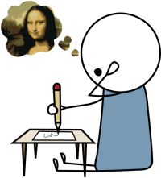

Drawing without using reference is one of my favourite hobbies. Struggling to pull an image out of the depths of my mind, like a fierce fish fighting for freedom. Reeling and reeling, until the moment when the fish bursts out of the still surface of the water, when the splash from the water blankets me as a sign of impending success. The rod sways unbalanced from the weight of the catch. The line could snap now, so I'm careful as pull it in and release it onto the paper. I look at the art of my creation as something new, something I haven't seen before... but the image feels familiar. I conjured this from my mind.

Getting something in your mind onto paper is a difficult process. You can't really focus on parts of the image in your mind. It's like imagining a line between two points, and then trying to focus on that line... but you can't, because it's not really there.

The frustration that you feel when you're trying to imbue your imagination onto reality, but just can't get it to look *quite right*. The relieving catharsis when you achieve a sense of familiarity with your creation. That is what stuttering is like.

## Frequently Asked Questions

-   **Are there certain things that make you stutter?**
    There are many factors, with a large grain of randomness. Getting too little or too much sleep makes it worse. Who I'm talking to makes a big difference --- large groups or people who I spend a lot of time with will rarely hear me stutter. If I spend a lot of time talking, I will stutter less over time. If I spend a lot of time not talking, I will stutter more. Some words are more "high risk" than others, in particular hard sounds like the C in *Computer Science*.
-   **I know what you're trying to say, but you can't get it out... should I say it for you or does that offend you?**
    By all means, speak up. Be my [autocomplete](http://web.archive.org/web/20100612205138/http://en.wikipedia.org/wiki/Autocomplete). In fact, it's easier for me to say a word after hearing someone else say it. Unless your guess is wrong, then it can get frustrating.
-   **What causes stuttering?**
    There is no conclusive answer. There are also various types of stuttering, most of which people grow out of after some years, and some of which you can train yourself to circumvent. There is definitely a large psychological factor, since I can speak to myself completely fluently. But there could just as easily be hard-coded physiological or neurological factors.

More questions are welcome.
